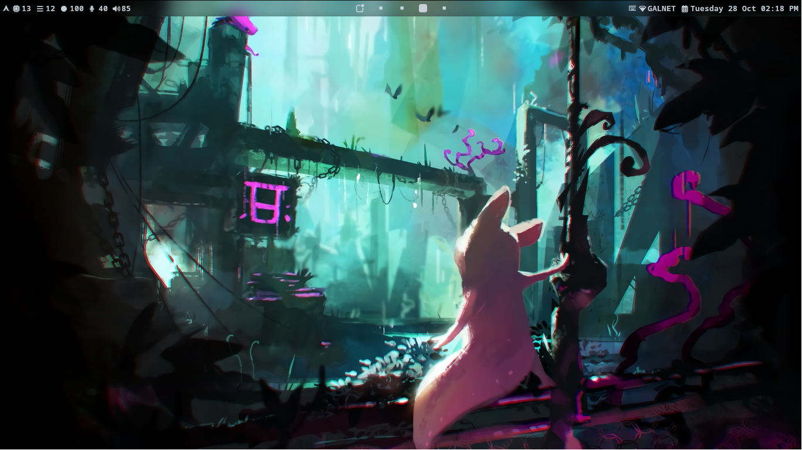
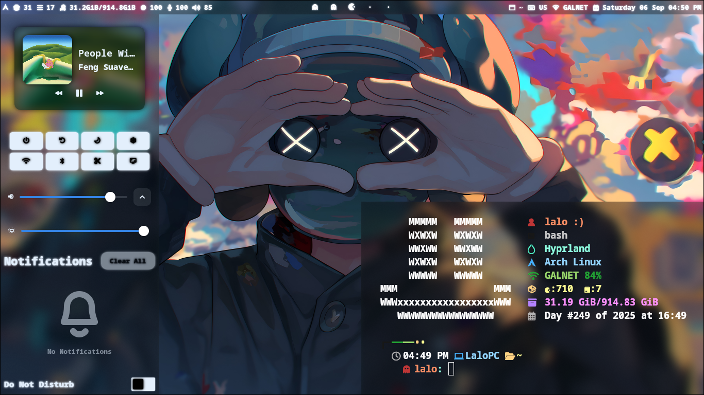
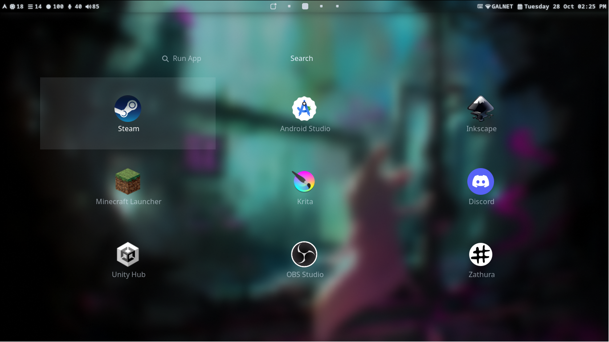
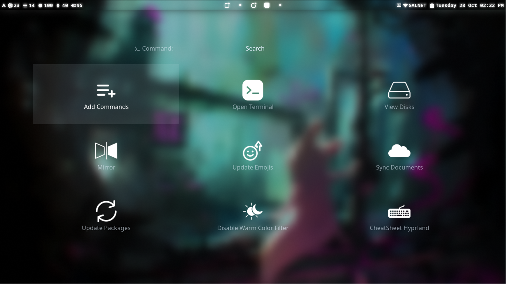
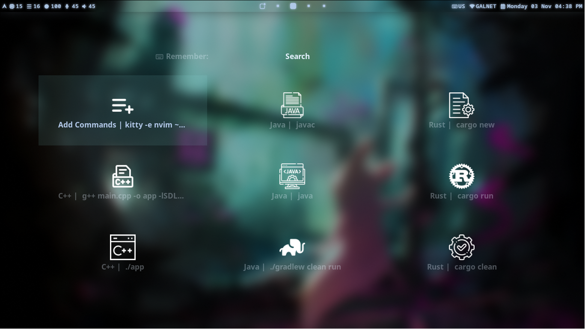
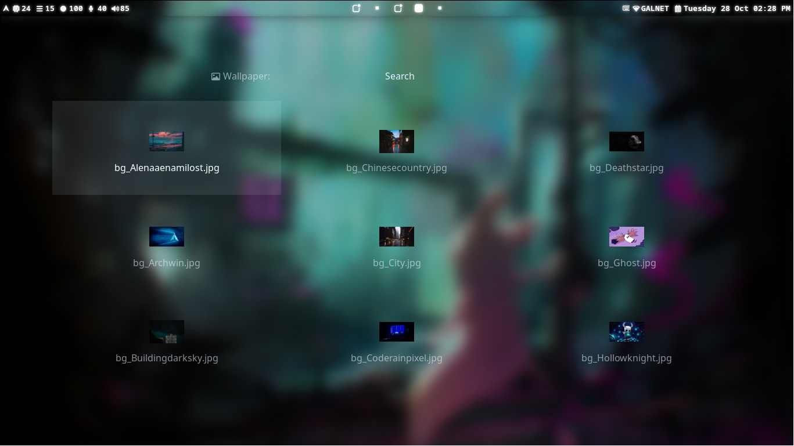
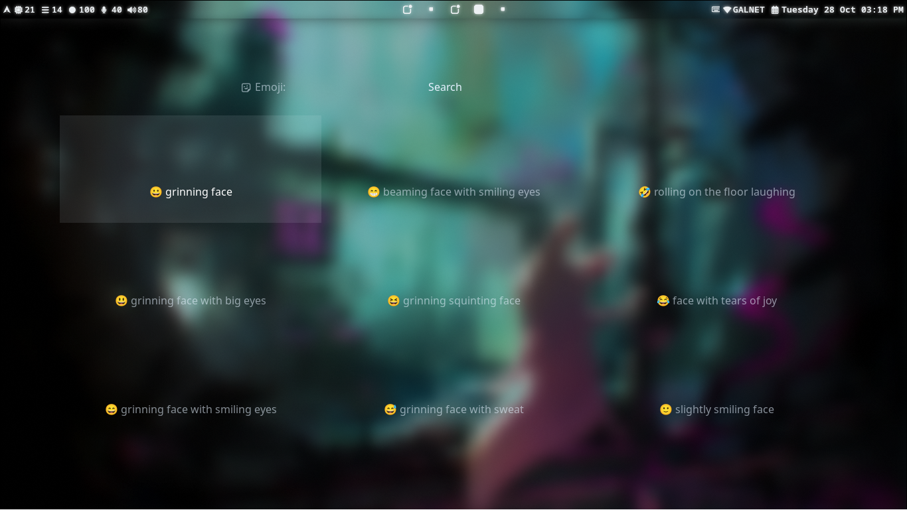
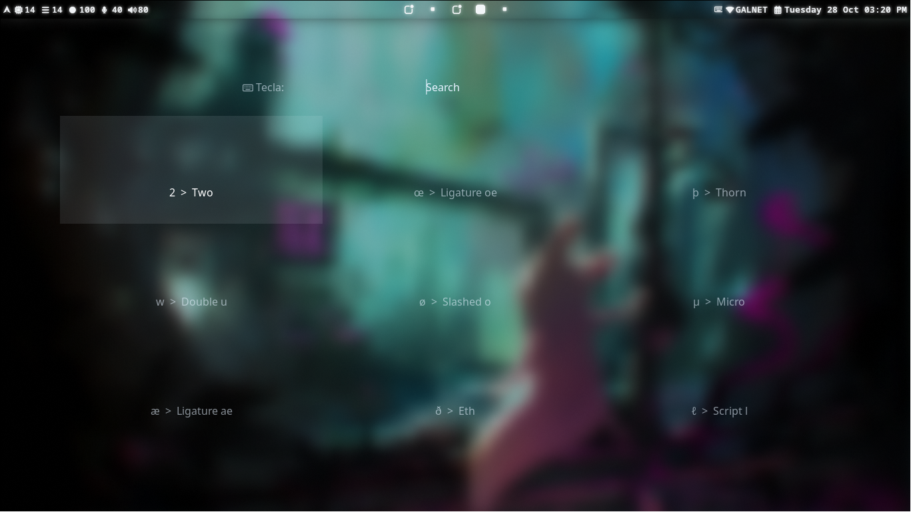

  
  
  

# Welcome to My Hyprland Rice
I want to show you a bit of my desktop — it’s a little minimalist. :)

\

## Stack
### Important
#### System
* **Package Managers:** Pacman / Flatpak / Yay / NPM (`JS`)
* **Bluetooth Manager:** Blueman
* **Audio Control:** Pavucontrol
* **Window Manager:** Hyprland
* **Shell:** Bash 5.3.3++
* **Terminal:** Kitty
#### Tools Hyprland
* **Warm Color Filter:** Hyprsunset
* **Notification:** Mako
* **Background Manager:** SWWW
* **File Manager:** Yazi
* **Launcher:** Rofi
* **JSON Parser / CLI Filter:** jq
* **Interactive Filtering Tool:** fzf
* **Clipboard:** Wl-Copy and CopyQ
* **Screenshot:** grim and slurp
#### Multimedia
* **Player Music:** MPD / NCMPCPP / MPC
* **Media Player:** MPV
* **Image Viewer:** IMV
* **Colors Manager:** Matugen
* **Status Bar:** Waybar **(Tray):** xdg-desktop-portal-gtk / xdg-desktop-portal / xdg-desktop-portal-hyprland
### Optional
* **IDE:** Neovim
* **Data Sync:** Rclone
* **PDF Reader:** zathura / zathura-pdf-poppler
* **Markdown Previewer:** Glow
* **Fuzzy Finder:** Skim (`sk`)
---

## Screenshots – Desktop

* **Desktop**

* **Modules**

* **Launcher App**

* **Launcher Command**

* **Launcher Remember**

* **Launcher Wallpaper**

* **Launcher Emoji**

* **Launcher Keyboard**

---

## Command Icons
The command icons used in the launcher were found on this website — feel free to download more for your own setup:
[**Flaticon**](https://www.flaticon.com/) | [**Freepik**](https://www.freepik.com/)
